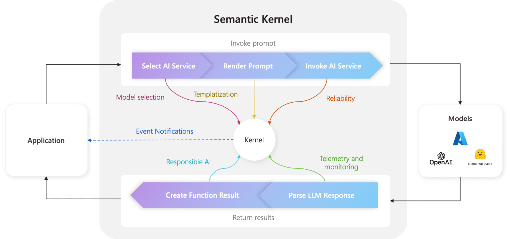
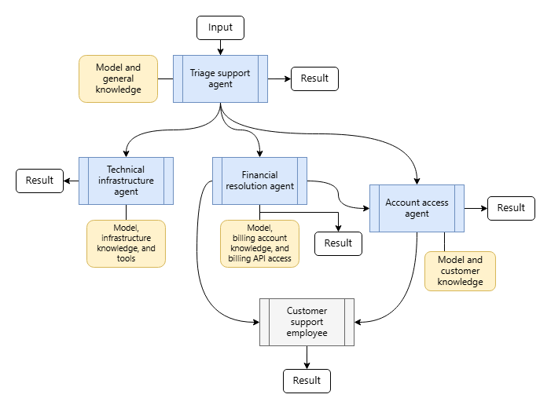
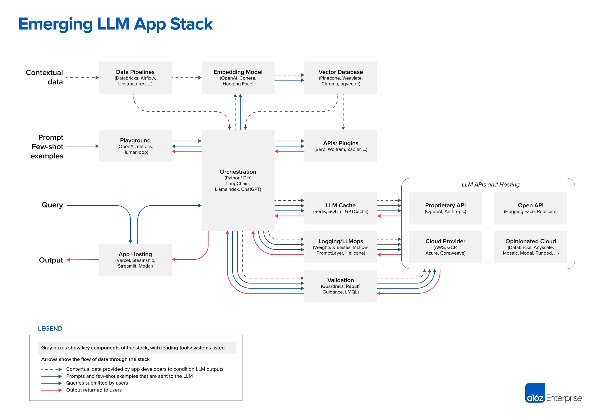
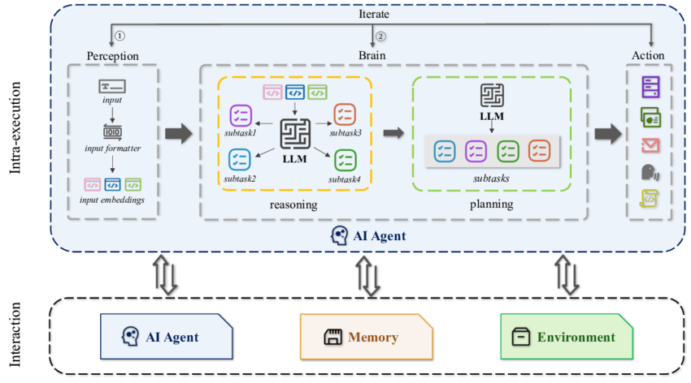
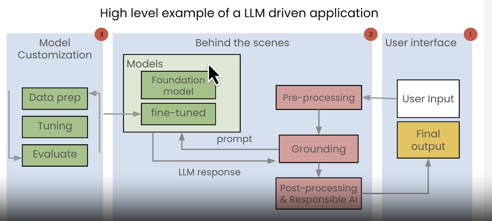
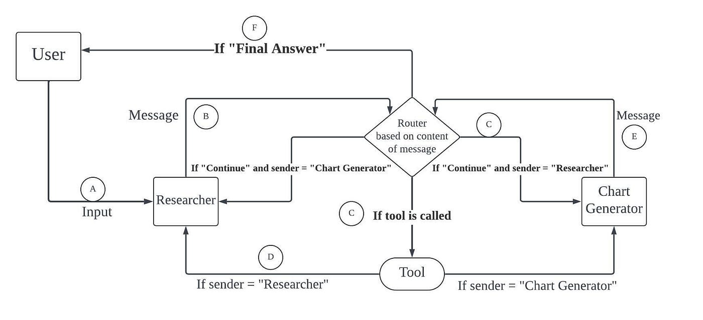
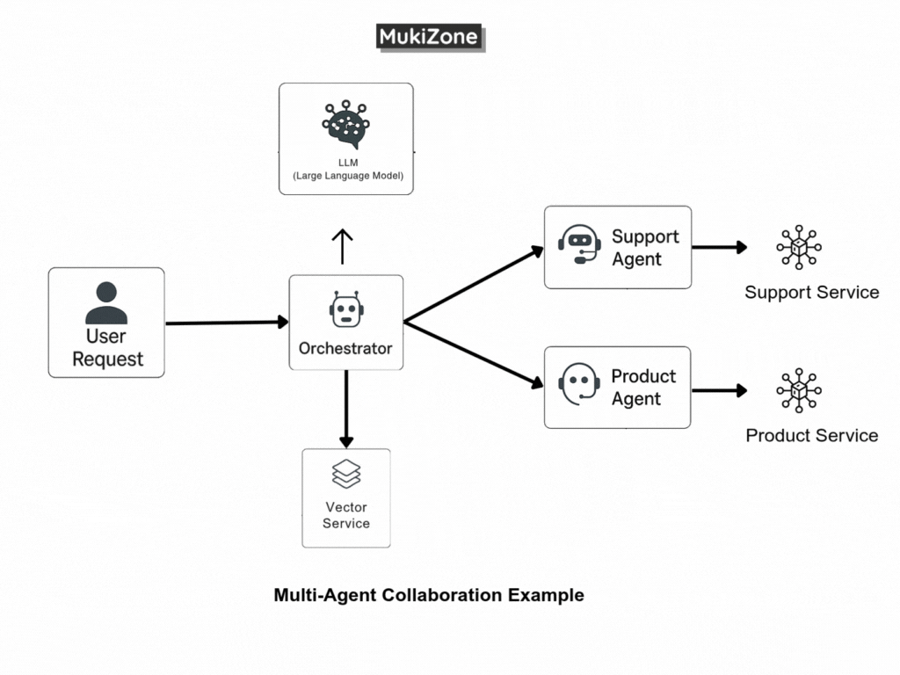

# 🧠 Semantic Kernel

### Build Intelligent AI Agents & Multi-Agent Systems


---

## 📌 Overview

**Semantic Kernel (SK)** is an open-source, model-agnostic AI orchestration SDK developed by Microsoft.

It enables developers to build:

* Intelligent AI agents
* Multi-agent systems
* Enterprise-grade AI workflows
* Plugin-driven AI applications
* Memory-augmented AI systems

Semantic Kernel acts as an orchestration layer between Large Language Models (LLMs), tools, memory stores, and business logic.

🔗 Repository: [https://github.com/microsoft/semantic-kernel](https://github.com/microsoft/semantic-kernel)
📜 License: MIT (Free & Open Source)

---

# 🛠 Tech Stack

## 💻 Supported Languages

* Python (3.10+)
* .NET (10.0+)
* Java (JDK 17+)

## 🤖 AI Model Support

* OpenAI
* Azure OpenAI
* Hugging Face
* NVIDIA AI
* Google (Gemini)
* Ollama (Local LLM)
* LMStudio
* ONNX Runtime

## 🗄 Vector Database Support

* Azure AI Search
* Elasticsearch
* Chroma
* Pinecone
* Redis
* Custom Vector Stores

## 🧩 Plugin Integration

* Native code functions
* Prompt templates
* OpenAPI specifications
* Model Context Protocol (MCP)

## 🌍 OS Support

* Windows
* macOS
* Linux

---

# 🚀 Key Features

* Model flexibility (Cloud + Local)
* Modular AI Agent Framework
* Multi-Agent Collaboration
* Plugin ecosystem
* Vector memory integration
* Multimodal processing (Text, Vision, Audio)
* Enterprise observability
* Local deployment support
* Process/workflow orchestration

---

# 🏗 Architecture

## High-Level Architecture







### Core Components

1. **Client Application**

   * Web app / API / CLI
2. **Semantic Kernel Core**

   * Central orchestrator
3. **LLM Connectors**

   * OpenAI, Azure, Ollama, etc.
4. **Plugins (Tools)**

   * Native functions or APIs
5. **Planner**

   * Breaks task into executable steps
6. **Memory Store**

   * Vector database for long-term memory
7. **Multi-Agent Layer**

   * Specialized collaborating agents

---

# 🔄 Control Flow (Execution Flow)







## Step-by-Step Flow

1️⃣ User sends request
2️⃣ Kernel receives prompt
3️⃣ Planner analyzes task
4️⃣ Required plugins selected
5️⃣ Memory retrieved (if needed)
6️⃣ LLM generates reasoning
7️⃣ Tools executed
8️⃣ Multi-agent collaboration (if configured)
9️⃣ Final response returned

---

# 📊 Advantages

✅ **Free & Open Source (MIT License)**
✅ Supports multiple programming languages
✅ Works with both cloud and local models
✅ Enterprise-ready architecture
✅ Built-in plugin system
✅ Multi-agent orchestration
✅ Strong Microsoft ecosystem integration
✅ Vector memory support
✅ Highly extensible
✅ Production-grade APIs

---

# ⚠ Disadvantages

❌ Requires LLM provider (unless local model used)
❌ Complex for beginners
❌ Enterprise-level abstraction may feel heavy for small apps
❌ Feature parity differences across languages
❌ Rapid updates may introduce breaking changes
❌ Setup complexity for advanced multi-agent systems

---

# 🔐 Enterprise Considerations

Semantic Kernel is built with:

* Observability support
* Structured APIs
* Secure integrations
* Scalable orchestration
* Workflow modeling
* Extensible plugin framework

Ideal for:

* Enterprise AI systems
* Multi-tenant SaaS
* AI-powered business automation
* Internal AI copilots
* Data-driven AI workflows

---

# 🧪 Installation

### Python

```bash
pip install semantic-kernel
```

### .NET

```bash
dotnet add package Microsoft.SemanticKernel
dotnet add package Microsoft.SemanticKernel.Agents.Core
```

### Java

Refer to semantic-kernel-java build instructions.

---

# 🧠 Example: Basic Python Agent

```python
import asyncio
from semantic_kernel.agents import ChatCompletionAgent
from semantic_kernel.connectors.ai.open_ai import AzureChatCompletion

async def main():
    agent = ChatCompletionAgent(
        service=AzureChatCompletion(),
        name="SK-Assistant",
        instructions="You are a helpful assistant.",
    )

    response = await agent.get_response(
        messages="Write a haiku about Semantic Kernel."
    )

    print(response.content)

asyncio.run(main())
```

---

# 🧩 Multi-Agent Example Concept

* Triage Agent → Decides task category
* Billing Agent → Handles payments
* Refund Agent → Handles refunds
* Kernel orchestrates collaboration

This demonstrates distributed reasoning among agents.

---

# 📈 When to Use Semantic Kernel

✔ Enterprise AI applications
✔ Multi-agent systems
✔ AI workflow orchestration
✔ Plugin-driven automation
✔ Business process modeling
✔ Memory-augmented AI systems
✔ Complex tool integrations

---


# 📚 Community & Ecosystem

* Active GitHub repository
* Enterprise usage
* Frequent feature additions
* Strong documentation
* Growing plugin ecosystem

---

# 🏁 Final Verdict

Semantic Kernel is best suited for:

> Enterprise-grade AI orchestration and multi-agent systems.

It is not just a chatbot framework — it is an AI application orchestration engine.

---


