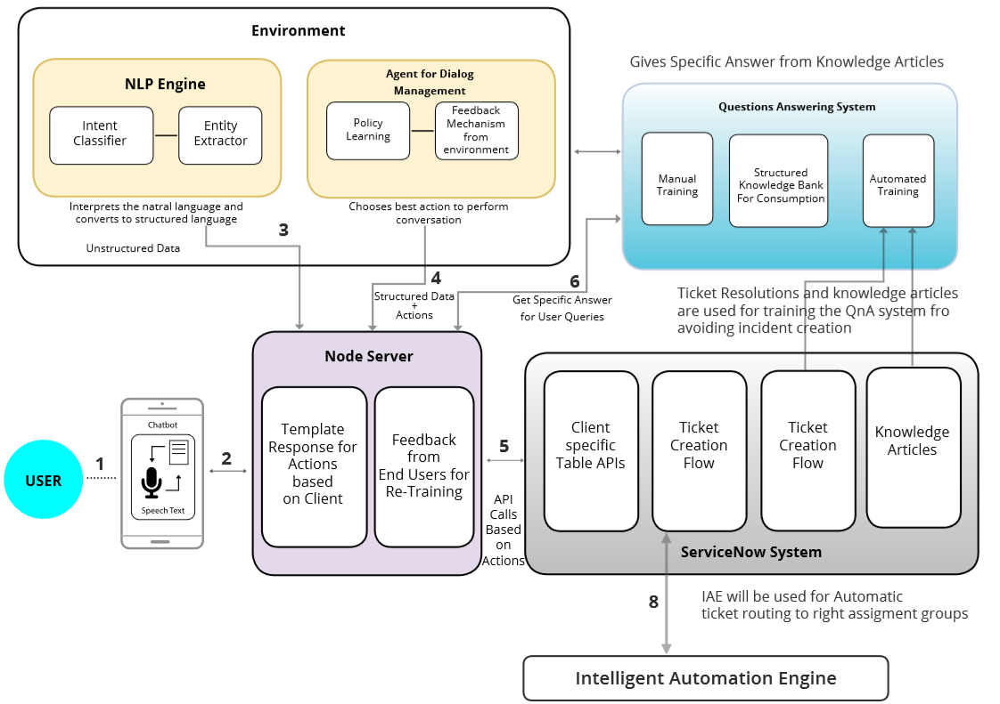
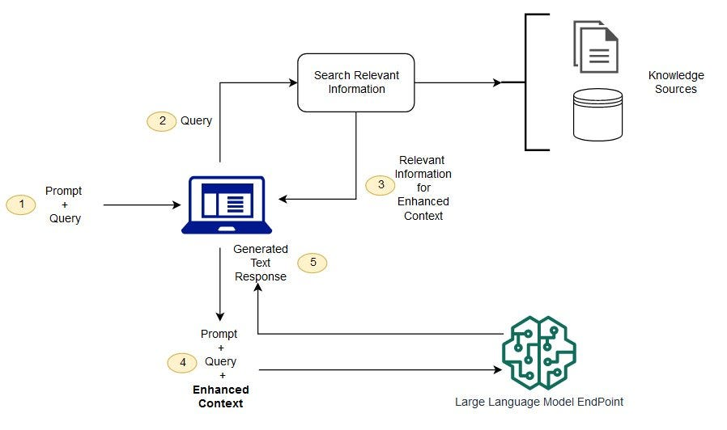
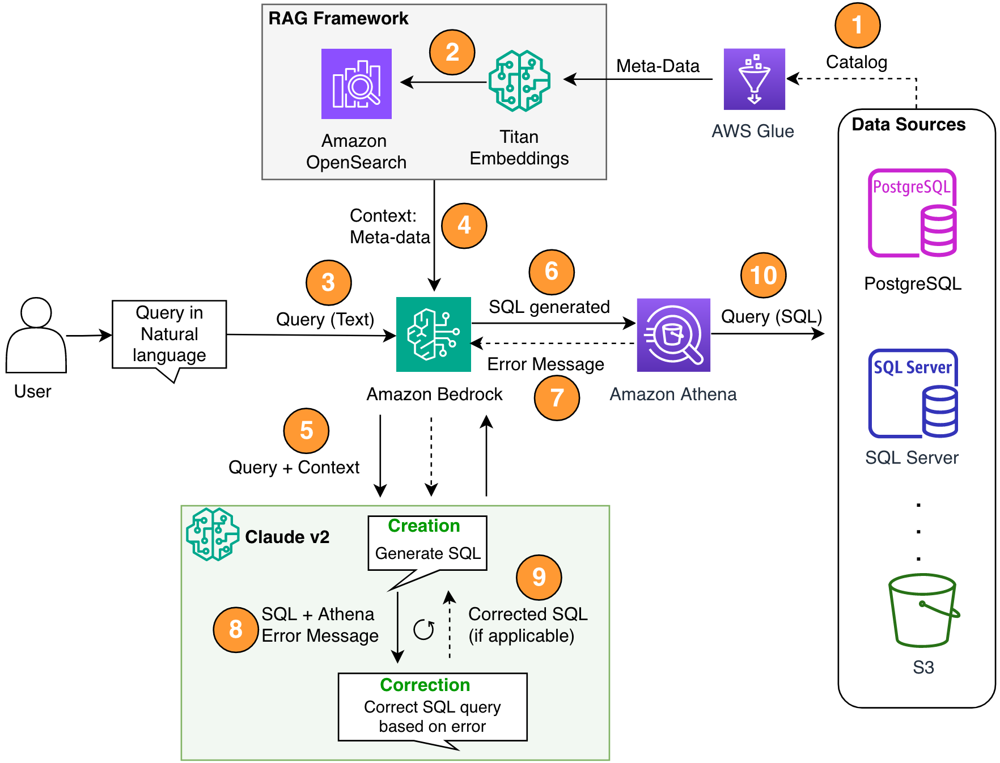
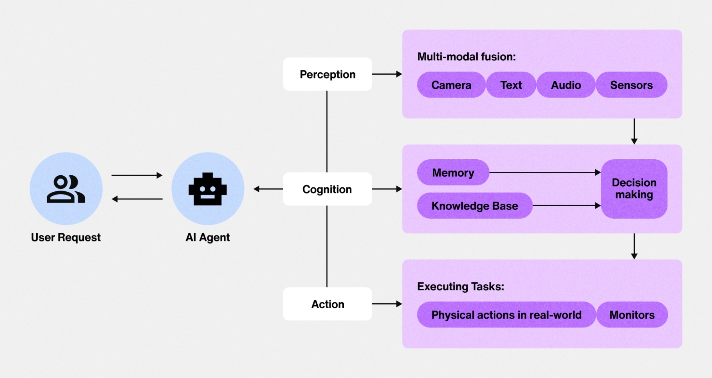
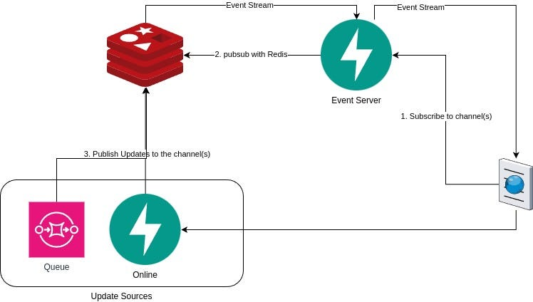
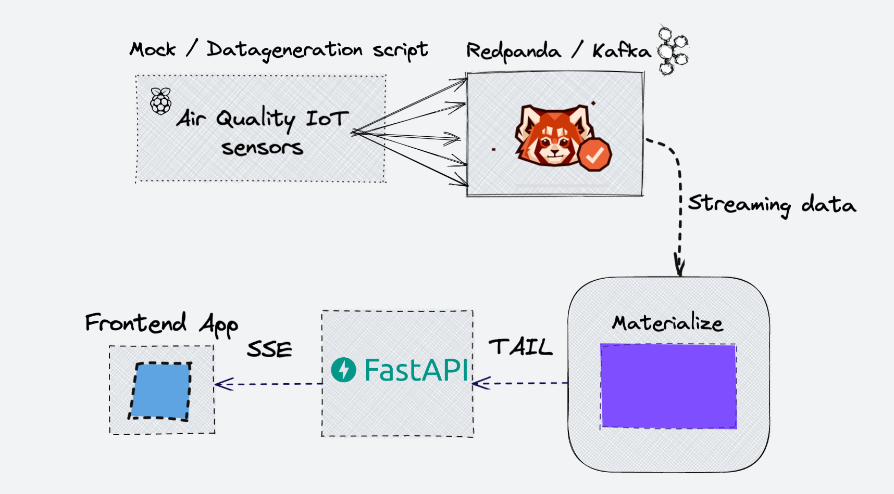

---

# 🚀 Vanna – Enterprise AI Data Agent (Free Setup)

A **production-ready, user-aware AI chatbot system** that converts natural language into SQL queries and streams interactive tables and charts in real time.

This setup supports:

* SQL Server `.bak` restore
* FastAPI backend
* Local LLM (Ollama – No API cost)
* `<vanna-chat>` web component
* Enterprise-grade security

💰 Total Cost: ₹0 (Using Local LLM)
🔒 Fully Local Deployment
🚫 No OpenAI token billing required

---

# 🌟 Key Features

🔐 **User-Aware at Every Layer**
Queries automatically filtered per user permissions.

🎨 **Modern Web Interface**
Beautiful pre-built `<vanna-chat>` component.

⚡ **Streaming Responses**
Real-time tables, charts, and progress updates.

🔒 **Enterprise Security**

* Row-level security
* Audit logs
* Rate limiting
* Per-user quotas

🔄 **Production-Ready**

* FastAPI integration
* Observability
* Lifecycle hooks

---

# 🛠 Tech Stack

## Backend

* Python 3.10+
* FastAPI
* Vanna Agent Framework
* Ollama (Local LLM)
* SQL Server Express
* SSE (Server-Sent Events Streaming)

## Frontend

* `<vanna-chat>` Web Component
* Plotly.js (Charts)
* HTML / React / Vue compatible

## Security

* JWT / Cookies
* Row-Level Security
* Audit Logging
* Rate Limiting
* Observability

---

# 🏗️ Architecture

## High-Level Architecture Diagram





## Architecture Layers

### 1️⃣ Frontend Layer

* `<vanna-chat>` component
* Streams UI components
* Uses existing authentication

### 2️⃣ API Layer

* FastAPI backend
* Streaming endpoint

### 3️⃣ Agent Layer

* User Resolver
* LLM Service (Ollama or other LLM)
* Tool Registry
* Lifecycle Hooks

### 4️⃣ Tool Layer

* SQL execution tool
* Custom tools
* Permission-aware execution

### 5️⃣ Database Layer

* SQL Server (Restored from `.bak`)
* Row-level filtering

---

# 🔄 Architecture Control Flow

## Control Flow Diagram







## Step-by-Step Flow

1️⃣ User asks a question in `<vanna-chat>`
2️⃣ Request sent to FastAPI streaming endpoint
3️⃣ User identity resolved (JWT / Cookies)
4️⃣ Agent builds user-aware system prompt
5️⃣ LLM generates SQL query
6️⃣ SQL executed on database
7️⃣ Row-level security filters results
8️⃣ Streaming response sent:

* Progress updates
* SQL block
* Interactive table
* Chart
* Natural language summary
  9️⃣ Audit log recorded

---

# 🔌 Free Setup Guide

## Step 1 – Restore `.bak` File

Install:

* SQL Server Express (Free)
* SQL Server Management Studio (Free)

Restore:
Databases → Restore Database → Select `.bak` file

---

## Step 2 – Install Ollama (Local LLM)

Download:
[https://ollama.com](https://ollama.com)

Pull model:

```bash
ollama pull llama3
```

Test model:

```bash
ollama run llama3
```

---

## Step 3 – Configure LLM in Backend

```python
from vanna.integrations.ollama import OllamaLlmService

llm = OllamaLlmService(model="llama3")
```

Now your AI runs fully locally with no API billing.

---

# ✅ Advantages

✔ Completely free using local LLM
✔ No external API dependency
✔ Fully offline capability
✔ Enterprise-level architecture
✔ User-aware permissions
✔ Built-in streaming UI
✔ Database agnostic
✔ Extensible with custom tools
✔ Works with existing authentication

---

# ❌ Disadvantages

⚠ Requires sufficient RAM (8–16GB recommended)
⚠ Local models slower than cloud LLMs
⚠ Slightly lower reasoning quality
⚠ Setup complexity for beginners
⚠ Manual infrastructure management

---

# 🔐 Security Model

* Identity flows through prompts and tools
* SQL filtered per user permissions
* Audit logging enabled
* Per-user quotas supported
* Rate limiting supported

---

# 🧠 Advanced Capabilities

* Lifecycle hooks
* LLM middleware
* Conversation storage
* Observability & tracing
* Context enrichment (RAG support)
* Custom tool development

---

# 📌 Summary

This project delivers a:

🔐 Secure
⚡ Streaming
🧠 Intelligent
🎨 Modern UI
💰 Zero-cost AI Data Agent

Using:

SQL Server `.bak` + FastAPI + Local LLM (Ollama) + Web Component

---

