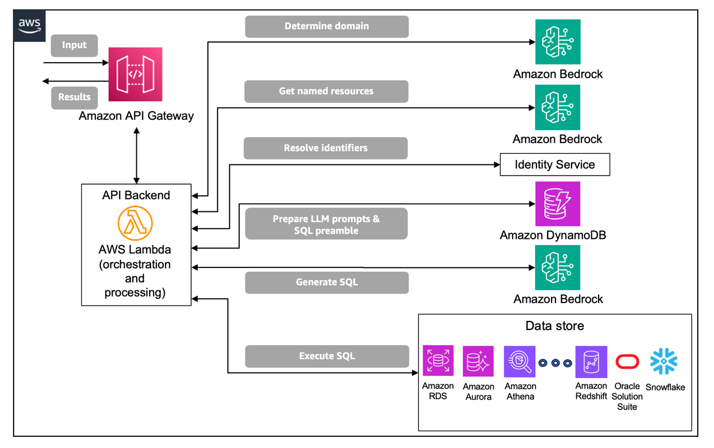
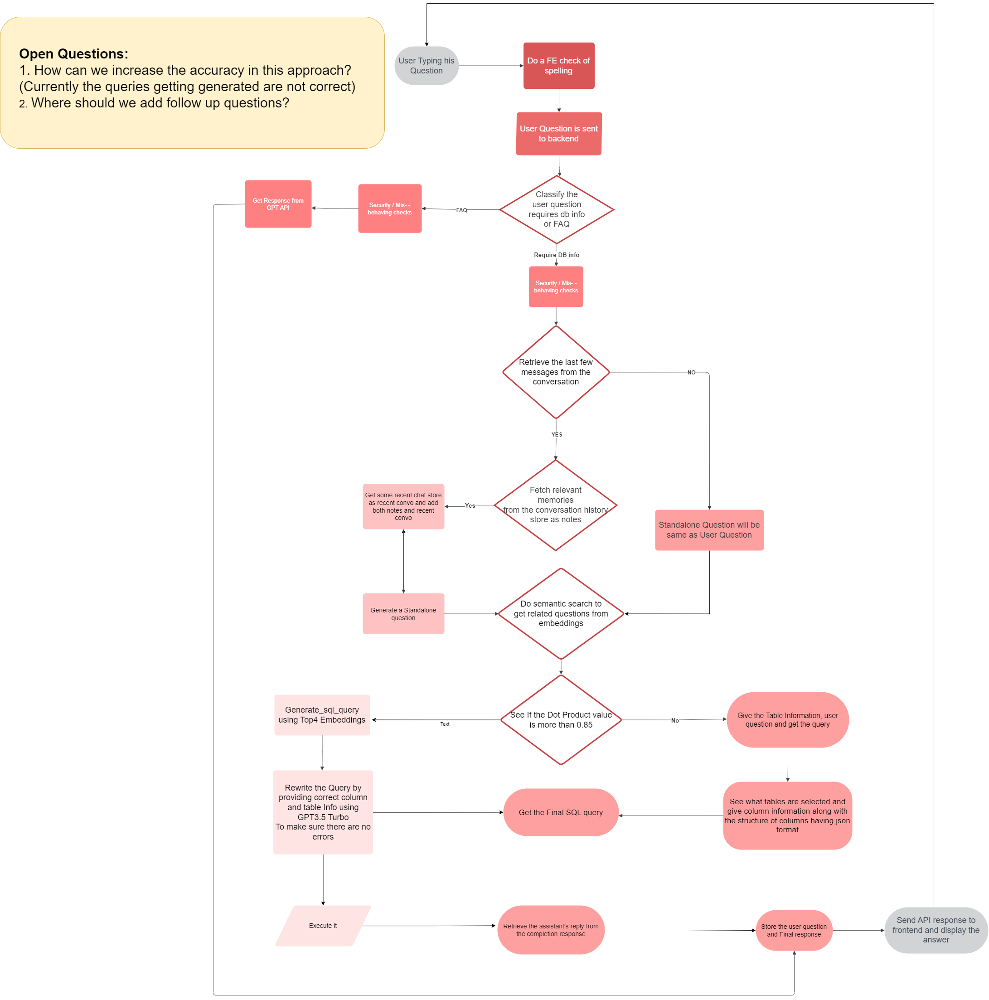

> **AI-Assisted MM Card Bulk Registration & NL → SQL → DB → NL Chatbot System**


# ✅ 1. Is NL → SQL → DB → NL Possible for Your System?

**Yes — 100% feasible.**

You have:

* ✔ Structured SQL Server database (.BAK)
* ✔ 25,000 records (very manageable)
* ✔ Clearly defined schema (registrations, agents, batches, errors)
* ✔ Reporting-based use case

This is an ideal scenario for a Text-to-SQL chatbot.

25k rows is small for SQL Server. Even 1M rows would be fine.

---

# 🏗 2. System Architecture





---

# 🔄 3. End-to-End Workflow

### Step 1 – User Question

User asks:

> “How many MM cards were successfully registered this month?”

---

### Step 2 – Schema Injection

System provides database schema to LLM:

* Tables
* Columns
* Relationships
* Data types

---

### Step 3 – LLM Converts NL → SQL

Example generated SQL:

```sql
SELECT COUNT(*) 
FROM mm_card_registrations
WHERE status = 'Success'
AND registration_date >= DATEFROMPARTS(YEAR(GETDATE()), MONTH(GETDATE()), 1);
```

---

### Step 4 – SQL Execution

Query runs on:

* Restored .BAK SQL Server database
* Read-only database user

---

### Step 5 – DB Returns Result

Example:
`2145`

---

### Step 6 – NL Response Generation

System converts:

> “2,145 MM Cards were successfully registered this month.”

---

# 🧰 4. Recommended Technical Stack (Enterprise Level)

## 🗄 Database Layer

* Microsoft SQL Server
* SQL Server Management Studio (SSMS)

---

## ⚙ Backend

* Python
* FastAPI
* SQLAlchemy / pyodbc

---

## 🤖 LLM Layer

* ollama (local inference)
* defog-ai
* langchain-ai

---

## 🖥 Frontend

* React
* Streamlit (for internal dashboard)

---

# 📊 5. Use Cases for Your MM Card System

Your chatbot can answer:

### 📈 Registration Analytics

* Total registrations today
* Monthly growth trend
* Branch-wise registrations
* Agent-wise performance

### ❌ Error Monitoring

* Failed registrations count
* Most common validation error
* Batch failure percentage
* Exception reports

### 🏢 Operational Intelligence

* Average processing time
* Peak upload time
* Top performing region
* SLA compliance tracking

---

# 🟢 6. Advantages

### 🚀 1. Productivity Boost

Managers no longer depend on SQL experts.

---

### 📉 2. Operational Risk Reduction

Less manual report preparation.

---

### 📊 3. Real-Time Data Access

Live insights from database.

---

### 🔐 4. Secure (On-Prem)

Local LLM = No data leaves organization.

---

### 📈 5. Scalable

25k → 100k → 1M records manageable.

---

### 💰 6. Low Running Cost

No API subscription required.

---

# 🔴 7. Disadvantages / Challenges

### ❌ 1. Wrong SQL Risk

LLM may hallucinate joins.

Solution:

* Provide clear schema
* Use SQL validation layer

---

### ❌ 2. Security Risks

Must block:

```
DROP
DELETE
UPDATE
ALTER
```

Allow only:

```
SELECT
```

---

### ❌ 3. Complex Business Logic

Very advanced financial rules may require stored procedures.

---

### ❌ 4. Schema Changes

If DB schema changes, LLM prompts must be updated.

---

# 🔐 8. Security Best Practices

✔ Use read-only DB user
✔ Validate SQL before execution
✔ Add query timeout
✔ Log all queries
✔ Limit row output

---

# 🖥 9. Hardware Recommendation (Local Deployment)

For 25k records:

* 16GB RAM
* 8-core CPU
* 20GB disk for model storage
* GPU optional (recommended but not mandatory)

---

# 🏢 10. Deployment Options

### Option A – On-Prem (Recommended)

* SQL Server internal
* Ollama local
* Secure intranet access

### Option B – Cloud

* Azure SQL
* VM-hosted LLM
* API-based architecture

---

# 🏆 11. Best Suitable GitHub Repositories (Top 3 – Production Oriented)

These are best suited for your system.

---

## 1️⃣ 🥇 SQLCoder (Best for Accuracy)

🔹 Repository:
[https://github.com/defog-ai/sqlcoder](https://github.com/defog-ai/sqlcoder)

Maintained by: defog-ai

### Why Best?

* Specifically trained for Text-to-SQL
* High benchmark accuracy
* Works well with structured enterprise DB
* Ideal for SQL Server schema

Best for:
✔ Accurate query generation
✔ Enterprise reporting chatbot

---

## 2️⃣ 🥈 LangChain SQL Agent

🔹 Repository:
[https://github.com/langchain-ai/langchain](https://github.com/langchain-ai/langchain)

Maintained by: langchain-ai

### Why Useful?

* Easy SQL agent setup
* Supports SQL Server
* Production-grade orchestration
* Can combine tools + validation layer

Best for:
✔ End-to-end pipeline
✔ Multi-tool integration
✔ Rapid development

---

## 3️⃣ 🥉 Ollama (Local LLM Deployment)

🔹 Repository:
[https://github.com/ollama/ollama](https://github.com/ollama/ollama)

Maintained by: ollama

### Why Important?

* Run LLM locally
* No API cost
* Secure enterprise usage
* Easy model switching

Best for:
✔ On-prem secure deployment
✔ Data privacy

---

# 🏆 Final Recommendation (Best for All-Time Enterprise Use)

For your **MM Card Bulk Registration Automation System**:

👉 Combine:

* SQLCoder (accuracy)
* LangChain (pipeline)
* Ollama (local deployment)

This combination gives:

✔ High SQL accuracy
✔ Secure architecture
✔ Scalable system
✔ Enterprise ready
✔ Works perfectly with 25,000 records
✔ Fully compatible with SQL Server (.BAK)

---

# 🎯 Final Verdict

Yes.

Your 25k record SQL Server database
+
Bulk MM Card automation system
+
NL → SQL → DB → NL chatbot

is technically sound, scalable, secure, and enterprise-suitable.

---

