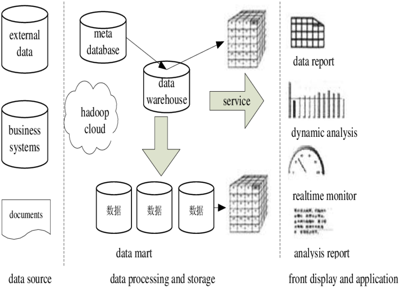
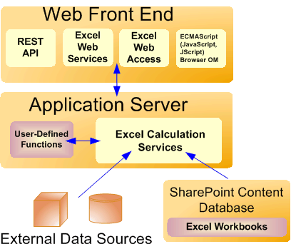
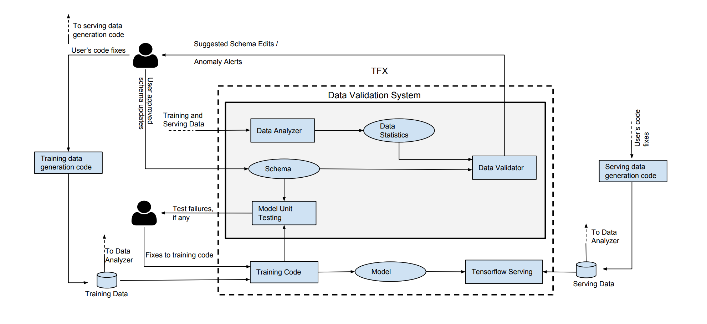
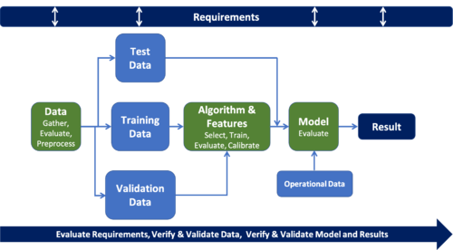
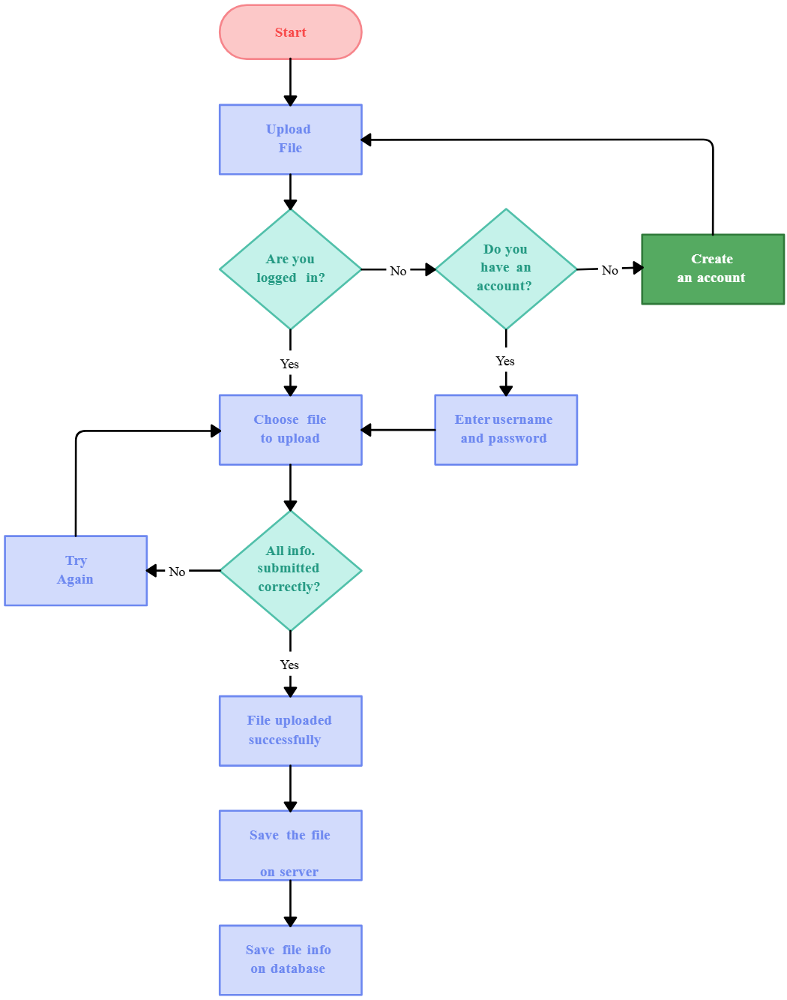
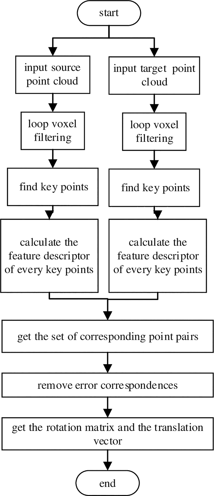
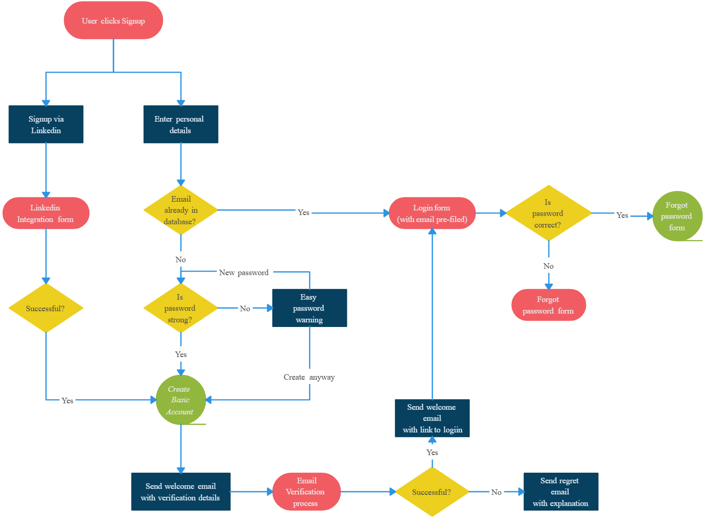

---
`AI_Assisted_MM_Card_Bulk_Registration_Research_With_Diagrams.md`

---

# AI-Assisted MM Card Bulk Registration & Onboarding Automation

## Research & System Design Document

---

# 1. Executive Summary

MM Card bulk registration is currently manual, time-consuming, and error-prone. Sales teams spend excessive time entering data instead of focusing on customer activation and engagement.

This project proposes an **AI-assisted bulk onboarding system** where structured Excel files are uploaded and automatically:

* Validated
* Cleaned
* Checked for duplicates
* Registered in bulk
* Flagged for exceptions
* Logged for audit

The goal is to improve:

* Productivity & efficiency
* Operational risk control
* Customer onboarding experience

---

# 2. High-Level System Architecture

## 🔷 Architecture Overview

---

## 🔷 Architecture Explanation

### 1. User Interface Layer

* Secure login
* Excel file upload
* Validation preview
* Status tracking
* Exception download

### 2. Application Layer (Backend)

* File parsing (Pandas/OpenPyXL)
* Validation engine
* Business rule processor
* Registration service

### 3. AI Validation Layer

* Fuzzy duplicate detection
* Address normalization
* Anomaly detection
* Fraud risk scoring (optional)

### 4. Processing Layer

* Asynchronous batch processing
* Queue management (Celery/Redis)
* Bulk database operations

### 5. Database Layer

* Customer records
* Upload batch logs
* Exception records
* Audit trail

### 6. Integration Layer

* MM Card Core System API
* CRM integration
* Notification services

---

# 3. System Workflow

## 🔷 End-to-End Workflow

---

## 🔷 Workflow Steps Explained

### Step 1 – Excel Upload

User uploads structured Excel template.

### Step 2 – Schema Validation

System checks:

* Required columns
* Data types
* File format

If invalid → File rejected.

---

### Step 3 – Data Cleaning

* Remove whitespace
* Standardize case
* Normalize date formats
* Remove invalid characters

---

### Step 4 – AI-Based Validation

* Duplicate detection (fuzzy matching)
* Similar address detection
* Anomaly pattern identification

---

### Step 5 – Bulk Processing

* Data divided into batches
* Background task queue processes records
* Registration API triggered

---

### Step 6 – Exception Handling

Invalid records:

* Stored separately
* Downloadable error report generated
* Manual review option available

---

### Step 7 – Reporting & Dashboard

* Total processed
* Success count
* Failed count
* Risk alerts
* Processing time

---

# 4. Technical Stack Recommendation

## Backend

* Python 3.10+
* Django / FastAPI
* Pandas
* OpenPyXL
* Celery
* Redis

## AI Layer

* RapidFuzz
* Scikit-learn (optional)
* Rule-based engine

## Database

* PostgreSQL (preferred)
* MySQL (if existing)

## Deployment

* Docker
* Nginx
* AWS / Azure / GCP

---

# 5. Advantages

* 70–90% reduction in manual effort
* Lower human error rate
* Faster customer onboarding
* Strong audit trail
* Scalable architecture
* Better regulatory compliance

---

# 6. Disadvantages & Mitigation

## Poor Data Quality

Mitigation:

* Standard Excel template
* Multi-layer validation
* Data cleaning engine

---

## AI False Positives

Mitigation:

* Confidence threshold
* Human-in-the-loop review
* Continuous learning

---

## High Initial Cost

Mitigation:

* Phased MVP approach
* Use open-source frameworks
* Incremental rollout

---

## Staff Resistance

Mitigation:

* Training
* Pilot testing
* Gradual deployment

---

## Security Risks

Mitigation:

* HTTPS encryption
* Database encryption
* RBAC
* Audit logs

---

## Scalability Issues

Mitigation:

* Batch processing
* Background workers
* Database indexing
* Cloud scaling

---

# 7. Implementation Phases

## Phase 1 – MVP

* Excel upload
* Basic validation
* Bulk insert
* Exception file

## Phase 2 – AI Enhancement

* Duplicate detection
* Anomaly detection

## Phase 3 – Reporting

* Dashboard
* Audit logs

## Phase 4 – Advanced Integration

* CRM
* Notifications
* Fraud scoring

---

# 8. GitHub Repositories for Research

django-import-export
[https://github.com/django-import-export/django-import-export](https://github.com/django-import-export/django-import-export)

pandas
[https://github.com/pandas-dev/pandas](https://github.com/pandas-dev/pandas)

RapidFuzz
[https://github.com/maxbachmann/RapidFuzz](https://github.com/maxbachmann/RapidFuzz)

Celery
[https://github.com/celery/celery](https://github.com/celery/celery)

Tesseract OCR
[https://github.com/tesseract-ocr/tesseract](https://github.com/tesseract-ocr/tesseract)

Apache Airflow
[https://github.com/apache/airflow](https://github.com/apache/airflow)

---

# 9. Final Evaluation

## Best Suitable When:

* High daily bulk registrations
* Manual errors common
* Compliance requirements high
* Sales team overloaded

## Not Ideal When:

* Very low registration volume
* No integration APIs
* Completely unstructured data process

---

# 10. Conclusion

The AI-Assisted MM Card Bulk Registration System provides:

* Measurable productivity gains
* Reduced operational risk
* Improved onboarding speed
* Enhanced compliance transparency

With proper phased implementation and secure architecture, this system becomes a scalable and enterprise-grade onboarding automation platform rather than just a simple upload tool.

---

